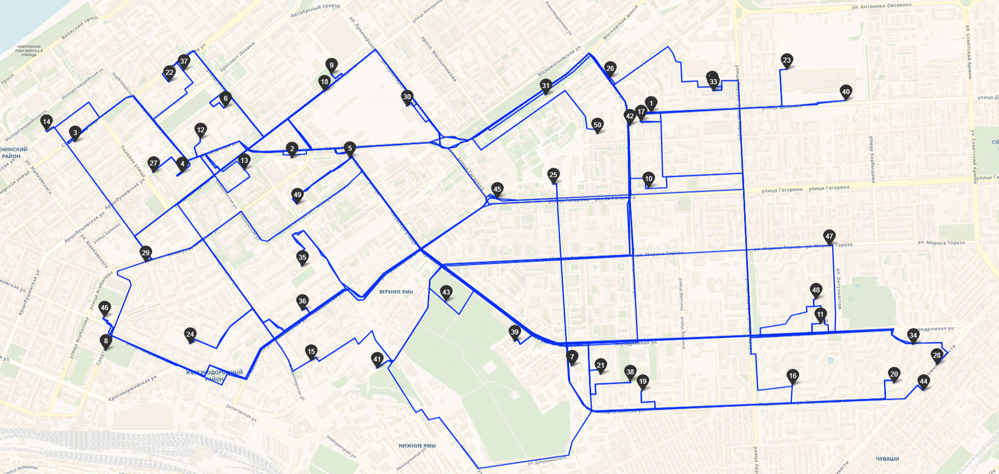
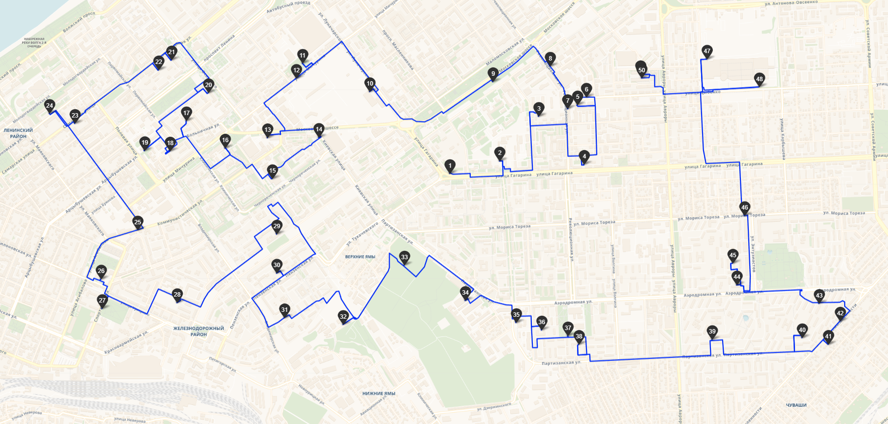

# Route Optimizer

Route Optimizer is a tool designed to build optimal routes based on given points. This project helps in finding the most efficient paths for travel, deliveries, or any other purposes where route optimization is needed.

## Features

- Efficient route calculation
- Support for multiple destinations
- Customizable parameters for route optimization
- Standardizes, handles variations and inconsistencies, validates and corrects invalid or incomplete addresses

## Installation

To install and run this project, you need to have [Poetry](https://python-poetry.org/) installed on your system. Poetry is a tool for dependency management and packaging in Python.

### Install Poetry

Follow the instructions on the [Poetry installation page](https://python-poetry.org/docs/#installation) to install Poetry on your system.

### Clone the Repository

```bash
git clone https://github.com/osebakosi/route-optimizer.git
cd route-optimizer
```

### Install Dependencies

Run the following command to install all the dependencies specified in the pyproject.toml file:
```bash
poetry install
```

## Usage

Once all dependencies are installed, you can run the Route Optimizer application using Poetry.
### Start the Application
```bash
poetry run python main.py
```
The application will start running on http://127.0.0.1:8000.

## Example of Work
[text](templates/index.html)
### Route

### Optimized route

